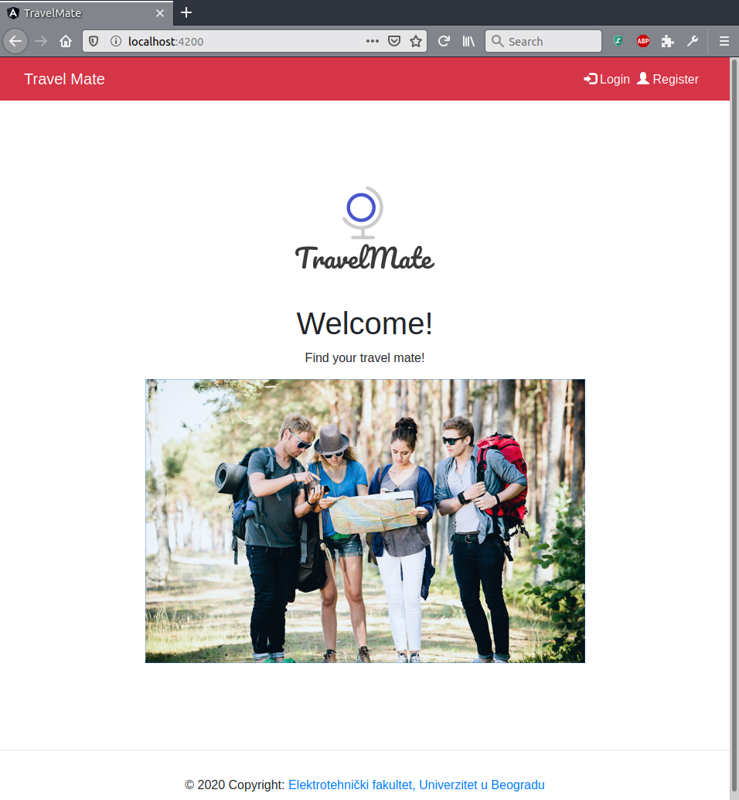
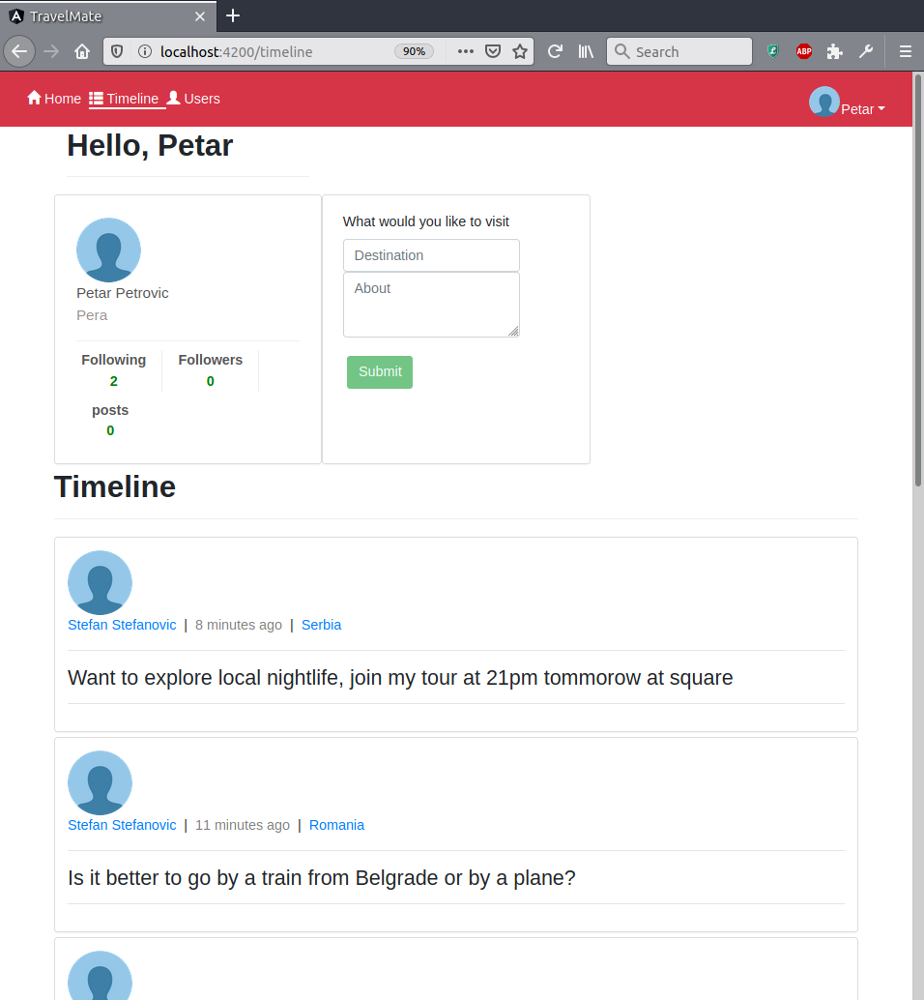
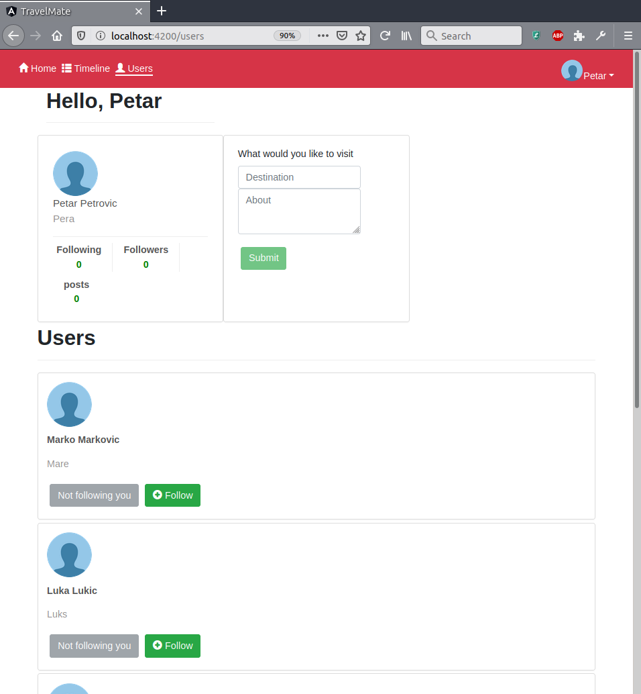
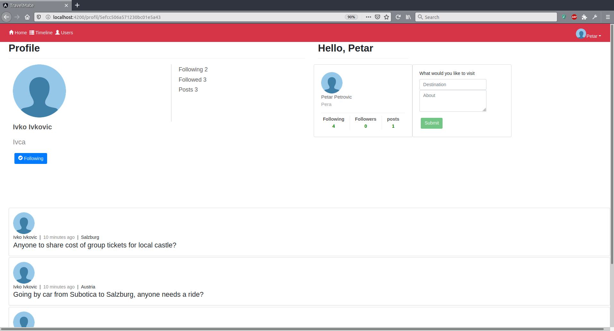
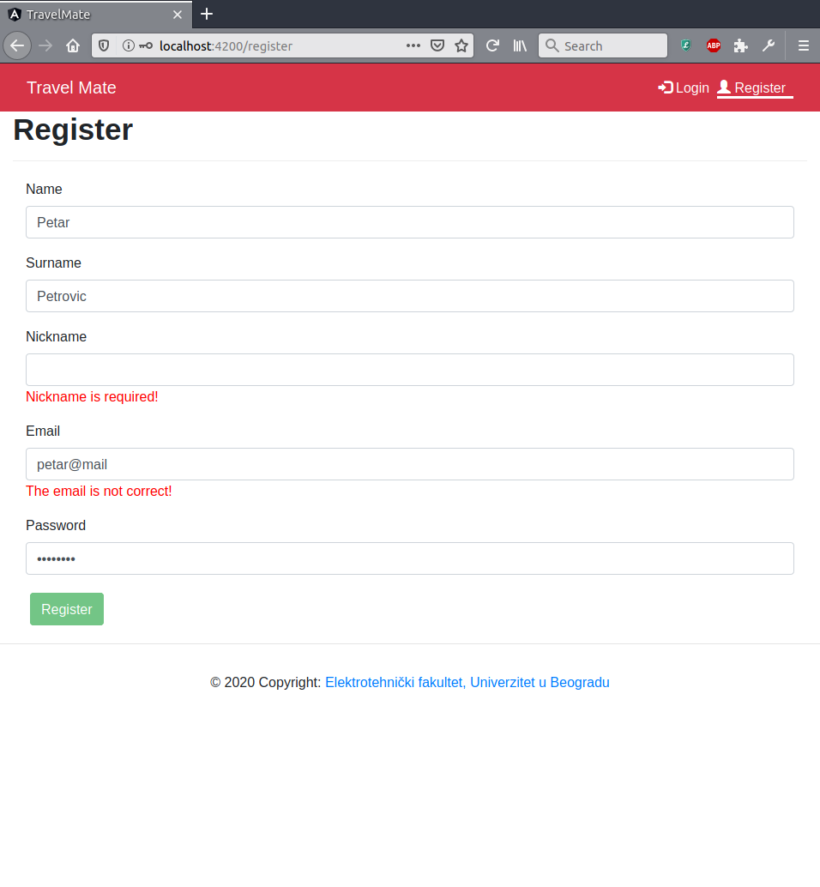

# TravelMate


This project was made for course Software Project Management at School of Electrical Engineering, University of Belgrade. TravelMate is a prototype of social network for travellers.

## How to start

* In tmServer directory:
```
npm start
```
* In main directory:
```
ng serve --open
```
* Navigate to http://localhost:4200/

## Screenshots of web app









